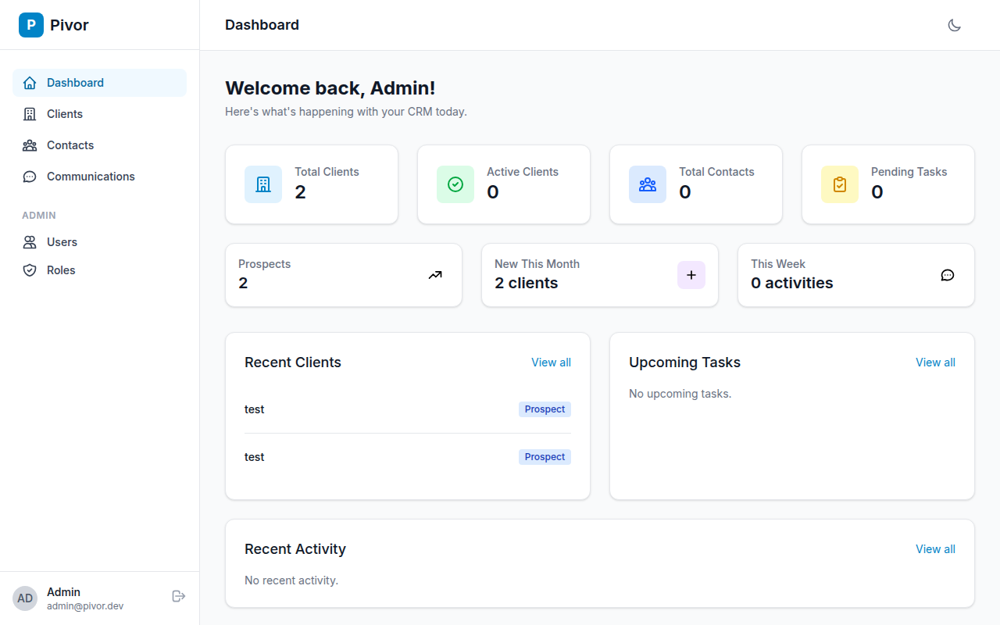
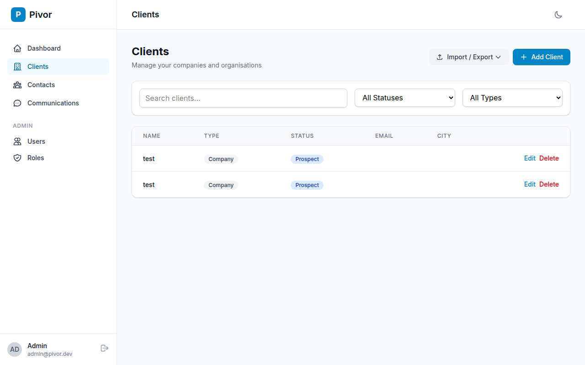
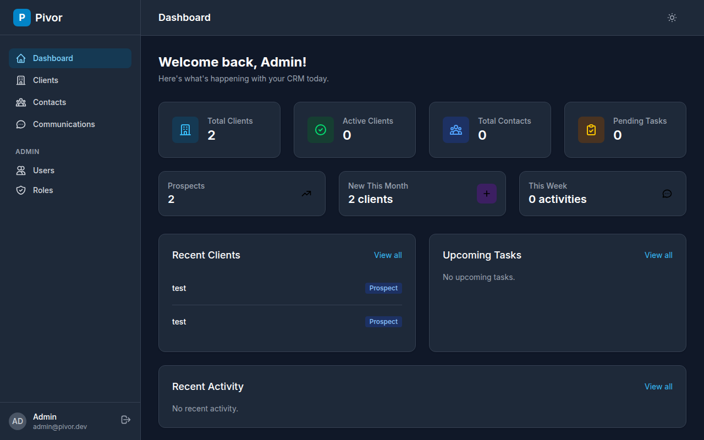
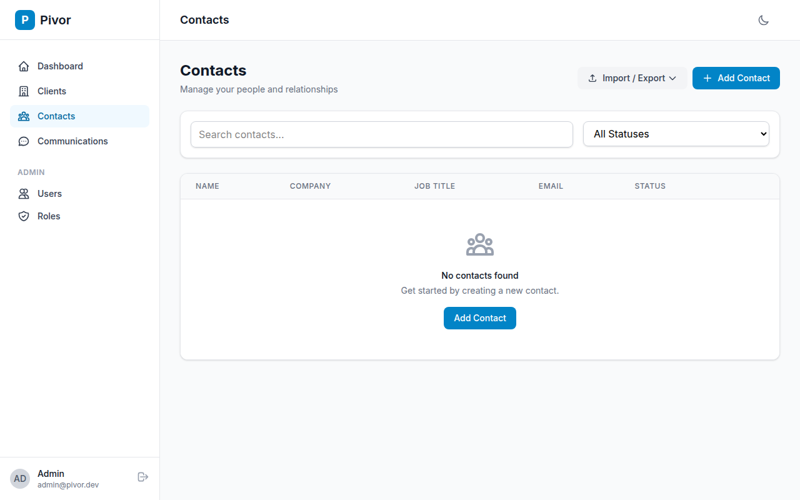
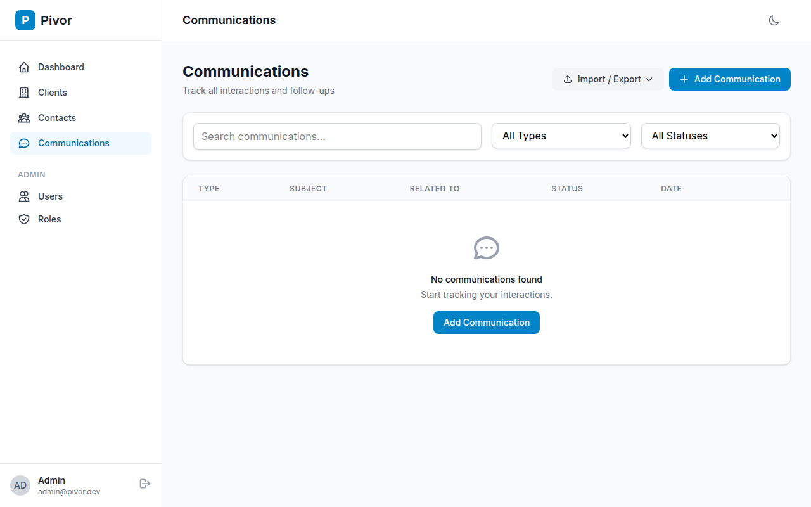
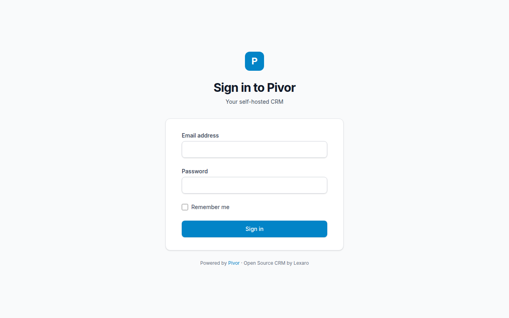

# Pivor

[](https://www.gnu.org/licenses/agpl-3.0)
[](https://php.net)
[](https://laravel.com)
[](https://livewire.laravel.com)

**Open Source, Self-Hosted CRM for Small Businesses**

Pivor gives businesses full ownership of their customer data without cloud dependency. Built by [Lexaro](https://lexaro.io).

## Screenshots

<p align="center">
  
  <br><em>Dashboard - Overview of your CRM activity</em>
</p>

<p align="center">
  
  <br><em>Clients - Manage companies and organisations</em>
</p>

<p align="center">
  
  <br><em>Dark Mode - Easy on the eyes</em>
</p>

<details>
<summary>More screenshots</summary>

<p align="center">
  
  <br><em>Contacts - Track people and relationships</em>
</p>

<p align="center">
  
  <br><em>Communications - Log all interactions</em>
</p>

<p align="center">
  
  <br><em>Login - Clean, simple authentication</em>
</p>

</details>

## Why Pivor?

Most CRMs lock your data in the cloud, charge per-seat pricing, and force you into their ecosystem. Pivor is different:

-   **Own Your Data** — Self-hosted means your customer data never leaves your servers. No vendor lock-in, no surprise price increases, no data mining.
-   **No Per-Seat Pricing** — One install, unlimited users. Pay nothing or pay for support—your choice.
-   **Simple by Design** — Not another bloated enterprise tool. Pivor does what you need without the complexity you don't.
-   **Open Source** — AGPL-3.0 licensed. Inspect the code, modify it, contribute back. Transparency builds trust.

## Features

-   **Clients** — Manage companies and organisations with full contact details, status tracking, and notes
-   **Contacts** — Track people and relationships with primary contact designation
-   **Communications** — Log all interactions: emails, calls, meetings, tasks, and follow-ups
-   **Multi-User Roles** — Role-based access control with admin, manager, and user roles with granular permissions
-   **Import/Export** — CSV import with field mapping wizard and export for clients, contacts, and communications
-   **Dashboard** — Overview of recent activity, pending tasks, and quick actions
-   **Dark Mode** — Easy on the eyes, day or night
-   **Self-Hosted** — Your data stays on your servers
-   **Modular** — Enable only what you need

## Quick Start

### Docker (Recommended)

```bash
# Clone the repository
git clone git@github.com:Lexaro-Software/pivor.git
cd pivor

# Copy environment file
cp .env.example .env

# Start Pivor
docker compose up -d

# Run migrations
docker compose exec app php artisan migrate --seed

# Access at http://localhost:8080
```

### Local Development

```bash
# Clone the repository
git clone git@github.com:Lexaro-Software/pivor.git
cd pivor

# Install dependencies
composer install
npm install

# Setup environment
cp .env.example .env
php artisan key:generate

# Run migrations and seed
php artisan migrate --seed

# Build assets
npm run build

# Start server
php artisan serve
```

### Default Login

-   **Email:** admin@pivor.dev
-   **Password:** password

> **Warning:** Change this immediately after first login.

## Tech Stack

-   **Backend:** Laravel 12, PHP 8.2+
-   **Frontend:** Livewire 3, Tailwind CSS 4
-   **Database:** SQLite (default), MySQL, PostgreSQL

## Requirements

-   PHP 8.2+
-   Composer 2+
-   Node.js 18+
-   SQLite / MySQL / PostgreSQL

## Modules

Pivor is built with a modular architecture:

| Module         | Description            | Status |
| -------------- | ---------------------- | ------ |
| Clients        | Company management     | Core   |
| Contacts       | People & relationships | Core   |
| Communications | Interaction history    | Core   |

## Configuration

### Environment Variables

```env
APP_NAME=Pivor
APP_URL=http://localhost:8080

DB_CONNECTION=sqlite
DB_DATABASE=/path/to/database.sqlite
```

## Contributing

Pivor is open source under AGPL-3.0. Contributions welcome!

1. Fork the repository
2. Create your feature branch (`git checkout -b feature/amazing-feature`)
3. Commit your changes (`git commit -m 'Add amazing feature'`)
4. Push to the branch (`git push origin feature/amazing-feature`)
5. Open a Pull Request

## License

[AGPL-3.0](LICENSE) — Use it, modify it, share your improvements.

## Support

-   Documentation: [docs/](docs/)
-   Issues: [GitHub Issues](https://github.com/Lexaro-Software/pivor/issues)
